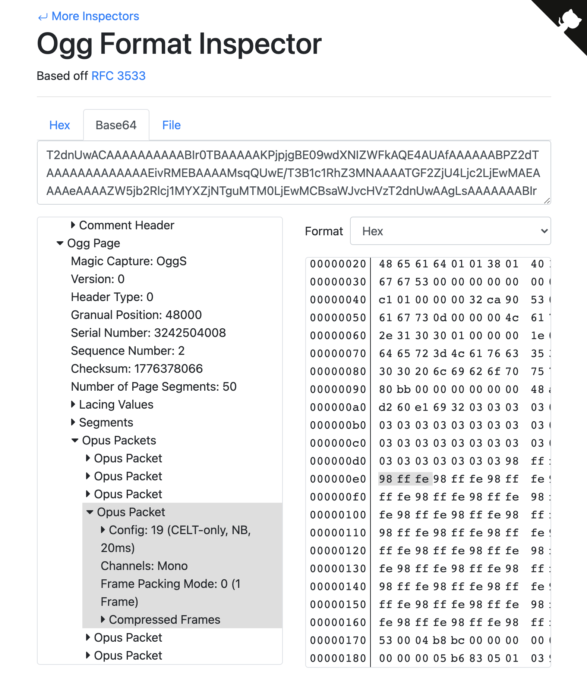
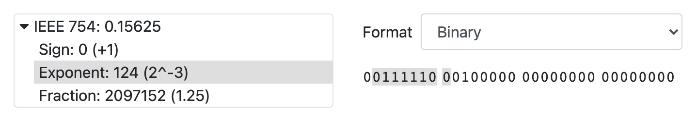

# 🔍 Binary Inspector

[](https://github.com/rameshvarun/binary-inspector/actions/workflows/node.js.yml)

This project contains web-based inspectors for binary formats. It can be used to help debug programs that process packets and binary data files. The project also contains an interface that makes it simple to write an inspector for a new binary format.

<p align="center">
   <a href="https://rameshvarun.github.io/binary-inspector/ogg/#data=T2dnUwACAAAAAAAAAABIr0TBAAAAAKPjpjgBE09wdXNIZWFkAQE4AUAfAAAAAABPZ2dTAAAAAAAAAAAAAEivRMEBAAAAMsqQUwE%2FT3B1c1RhZ3MNAAAATGF2ZjU4Ljc2LjEwMAEAAAAeAAAAZW5jb2Rlcj1MYXZjNTguMTM0LjEwMCBsaWJvcHVzT2dnUwAAgLsAAAAAAABIr0TBAgAAANJg4WkyAwMDAwMDAwMDAwMDAwMDAwMDAwMDAwMDAwMDAwMDAwMDAwMDAwMDAwMDAwMDAwMDAwOY%2F%2F6Y%2F%2F6Y%2F%2F6Y%2F%2F6Y%2F%2F6Y%2F%2F6Y%2F%2F6Y%2F%2F6Y%2F%2F6Y%2F%2F6Y%2F%2F6Y%2F%2F6Y%2F%2F6Y%2F%2F6Y%2F%2F6Y%2F%2F6Y%2F%2F6Y%2F%2F6Y%2F%2F6Y%2F%2F6Y%2F%2F6Y%2F%2F6Y%2F%2F6Y%2F%2F6Y%2F%2F6Y%2F%2F6Y%2F%2F6Y%2F%2F6Y%2F%2F6Y%2F%2F6Y%2F%2F6Y%2F%2F6Y%2F%2F6Y%2F%2F6Y%2F%2F6Y%2F%2F6Y%2F%2F6Y%2F%2F6Y%2F%2F6Y%2F%2F6Y%2F%2F6Y%2F%2F6Y%2F%2F6Y%2F%2F6Y%2F%2F6Y%2F%2F6Y%2F%2F6Y%2F%2F6Y%2F%2F6Y%2F%2F5PZ2dTAAS4vAAAAAAAAEivRMEDAAAABbaDBQEDmP%2F%2B"></a>
</p>
<p align="center">
  <a href="https://rameshvarun.github.io/binary-inspector/ogg/#data=T2dnUwACAAAAAAAAAABIr0TBAAAAAKPjpjgBE09wdXNIZWFkAQE4AUAfAAAAAABPZ2dTAAAAAAAAAAAAAEivRMEBAAAAMsqQUwE%2FT3B1c1RhZ3MNAAAATGF2ZjU4Ljc2LjEwMAEAAAAeAAAAZW5jb2Rlcj1MYXZjNTguMTM0LjEwMCBsaWJvcHVzT2dnUwAAgLsAAAAAAABIr0TBAgAAANJg4WkyAwMDAwMDAwMDAwMDAwMDAwMDAwMDAwMDAwMDAwMDAwMDAwMDAwMDAwMDAwMDAwMDAwOY%2F%2F6Y%2F%2F6Y%2F%2F6Y%2F%2F6Y%2F%2F6Y%2F%2F6Y%2F%2F6Y%2F%2F6Y%2F%2F6Y%2F%2F6Y%2F%2F6Y%2F%2F6Y%2F%2F6Y%2F%2F6Y%2F%2F6Y%2F%2F6Y%2F%2F6Y%2F%2F6Y%2F%2F6Y%2F%2F6Y%2F%2F6Y%2F%2F6Y%2F%2F6Y%2F%2F6Y%2F%2F6Y%2F%2F6Y%2F%2F6Y%2F%2F6Y%2F%2F6Y%2F%2F6Y%2F%2F6Y%2F%2F6Y%2F%2F6Y%2F%2F6Y%2F%2F6Y%2F%2F6Y%2F%2F6Y%2F%2F6Y%2F%2F6Y%2F%2F6Y%2F%2F6Y%2F%2F6Y%2F%2F6Y%2F%2F6Y%2F%2F6Y%2F%2F6Y%2F%2F6Y%2F%2F6Y%2F%2F6Y%2F%2F5PZ2dTAAS4vAAAAAAAAEivRMEDAAAABbaDBQEDmP%2F%2B">OGG OPUS EXAMPLE</a>
</p>

## Developing

```bash
git clone https://github.com/rameshvarun/binary-inspector.git
cd binary-inspector && npm install
npm start
```

## Adding a New  Inspector (IEEE 754 Single Precision Floating Point)

```typescript
// An inspector is defined by a function that takes a `ByteRange` and
// returns a `Tree`. `ByteRange`s wrap buffers and provide helpers
// for decoding data. `ByteRange`s can be sliced into subranges, as well as
// further sliced into a `BitRange`. `Tree`s describe the structure and
// contents of the data.
function inspect(range: ByteRange): Tree {
  // BitRanges for the sign, exponent and fraction.
  let sign = range.bits(0, 1);
  let exponent = range.bits(1, 8);
  let fraction = range.bits(9, 23);

  // The decoded floating point value.
  let decoded = range.readFloat32BE();

  // Create the inspection tree for the floating point.
  return new Tree(`IEEE 754: ${decoded}`, range, [
    new Tree(
      `Sign: ${sign.readUIntBE()} (${sign.readBool() ? "-1" : "+1"})`,
      sign
    ),
    new Tree(
      `Exponent: ${exponent.readUIntBE()} (2^${exponent.readUIntBE() - 127})`,
      exponent
    ),
    new Tree(
      `Fraction: ${fraction.readUIntBE()} (${1 +
        fraction.readUIntBE() / Math.pow(2, 23)})`,
      fraction
    )
  ]);
}

// We can use the SimpleInspector component to wrap our inspect function.
// Inspectors with special features will need a custom component.
ReactDOM.render(
  <SimpleInspector inspect={inspect} />,
  document.getElementById("root")
);
```

This creates an inspector that can be used to debug floating point numbers.

<p align="center">
  
</p>
